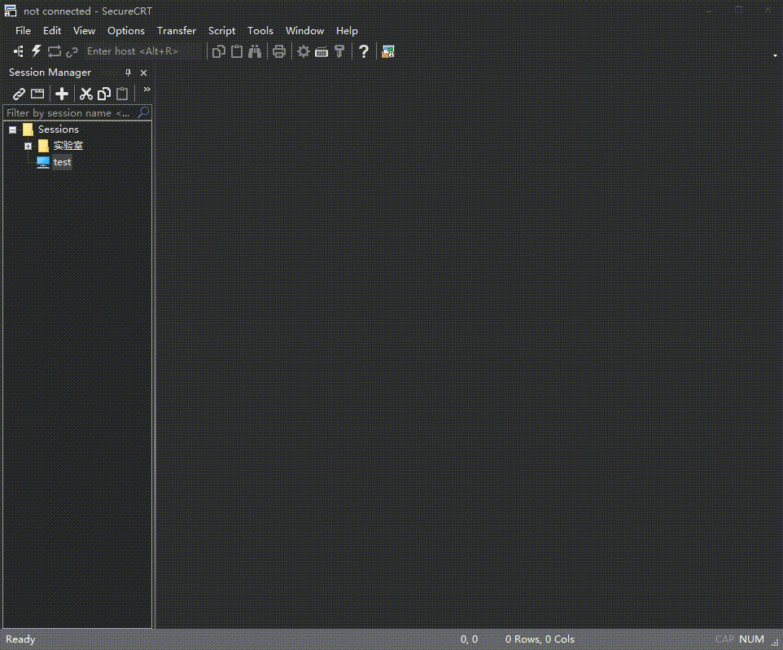

# agile_telnet

## 1、介绍

- [Telnet](https://baike.baidu.com/item/Telnet) 协议是一种应用层协议，使用于互联网及局域网中，使用虚拟终端机的形式，提供双向、以文字字符串为主的交互功能。属于 TCP/IP 协议族的其中之一，是 Internet 远程登录服务的标准协议和主要方式，常用于网页服务器的远程控制，可供用户在本地主机运行远程主机上的工作。

- `agile_telnet` 本质上是一个TCP服务器，提供TCP调试功能。由于telnet协议数据与TCP原始数据差异不大，`agile_telnet` 为了简单不对telnet协议中的一些数据处理，所以除了使用telnet终端登录，使用网络调试助手也是可以直接调试的，只是借用了telnet终端。

- 原本RT-Thread的网络小工具中已经有了telnet工具，但是使用中发现不少问题。
  1. 设备发送函数中使用了互斥锁等导致挂起的功能，不能再中断中使用。
  2. 设备发送函数是直接输出，调用send等占用栈空间不确定，导致线程打印log时都得扩大线程栈空间。
  3. 旧的客户端存在运行，新的客户端接入没做处理(关掉或挤掉)。
  4. 由于是调试使用，应该实现新接入的挤掉旧的。

- 鉴于原有telnet工具存在这样那样的问题，本人重写的telnet软件包命名为  `agile_telnet`。其具备如下特性：
  1. 设备发送函数中不直接输出，只加入环形缓冲区，几乎不会占用栈空间。
  2. 设备发送函数中不会操作任何可能导致挂起的操作，可以在中断中使用。
  3. 客户端具有超时时间(默认为3分钟)，若在规定时间内没有输入或输出则强制断开客户端。
  4. 客户端超时时间可设。
  5. 新接入的客户端会挤掉旧客户端，防止由于粗心之前旧的忘关了导致不能调试。
  6. 使用select编程，性能提升。

### 1.1 目录结构

| 名称 | 说明 |
| ---- | ---- |
| figures | 文档图片 |
| inc  | 头文件目录 |
| src  | 源代码目录 |

### 1.2 许可证

`agile_telnet` package 遵循 LGPLv2.1 许可，详见 `LICENSE` 文件。

### 1.3 依赖

- RT-Thread 3.0+
- SAL
- POSIX
- DFS

## 2、如何打开 agile_telnet

使用 `agile_telnet` package 需要在 RT-Thread 的包管理器中选择它，具体路径如下：

```
RT-Thread online packages
    IoT - internet of things  --->
        [*] agile_telnet: TCP debug for Ethernet  --->
            (2048) Set agile_telnet thread stack size
            (26)  Set agile_telnet thread priority
            (23)  Set agile_telnet listen port
            (256) Set agile_telnet rx buffer size
            (2048) Set agile_telnet tx buffer size
            (3)   Set agile_telnet client timeout(min)
                  Version (latest)  --->
```

- **Set agile_telnet thread stack size**：`agile_telnet`线程堆栈大小
- **Set agile_telnet thread priority**：`agile_telnet`线程优先级
- **Set agile_telnet listen port**：`agile_telnet`监听端口号
- **Set agile_telnet rx buffer size**：`agile_telnet`接收环形缓冲区大小
- **Set agile_telnet tx buffer size**：`agile_telnet`发送环形缓冲区大小
- **Set agile_telnet client timeout(min)**：`agile_telnet`客户端默认超时时间(3分钟)

然后让 RT-Thread 的包管理器自动更新，或者使用 `pkgs --update` 命令更新包到 BSP 中。

## 3、使用 agile_telnet

在打开 `agile_telnet` package 后，当进行 bsp 编译时，它会被加入到 bsp 工程中进行编译。



如上面动图所示，我开启了RT-Thread的IRQ调试功能，可以看到终端界面都是IRQ调试信息。之后我按住TAB键，可以看到帮助信息。

## 4、注意事项

- agile_telnet使能后是会自动将调试设备更改为`telnet`设备的，是在`INIT_BOARD_EXPORT`层注册设备并更改为调试设备的。
- 如果有设置串口设备为调试设备的操作确保其在`INIT_BOARD_EXPORT`之前，或者将其删除或注释。例如`stm32` `bsp`中`drv_common.c`中的设置串口设备为调试设备实在`INIT_BOARD_EXPORT`之前。
- 推荐删除或注释设置串口设备为调试设备的操作。实际生产过程中是不会TCP调试和串口都需要支持的。(产品都有网口了，为啥还要单独拉一路调试串口出来是吧。)
- 由于`agile_telnet`不是纯粹的telnet协议，只是TCP调试，只不过借用了telnet终端，所以客户端接入后会有几个无效字节，可以按下回车送给FINSH作为无效命令。主要想兼容网络调试助手，有需要的话可以下一版支持标准的telnet协议。
- `agile_telnet`线程自动初始化是`INIT_ENV_EXPORT`，确保设备读操作在其后。RT-Thread的`FINSH`线程是`INIT_APP_EXPORT`。
- `agile_telnet`不会强制打开`FINSH`组件，未开启时作为纯粹的输出显示。如要输入调试请开启`FINSH`组件。
- 使用以太网设备请使能以太网设备和`lwip`，这些`agile_telnet`不会强制打开，只强制选中到`SAL`层。

## 5、联系方式 & 感谢

- 维护：malongwei
- 主页：<https://github.com/loogg/agile_telnet>
- 邮箱：<2544047213@qq.com>
